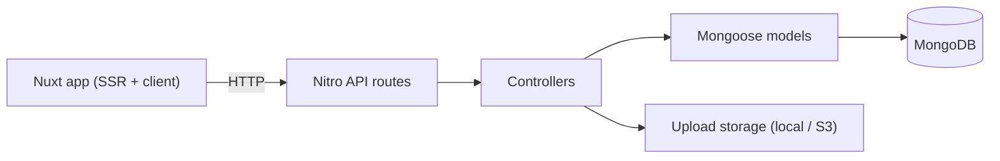
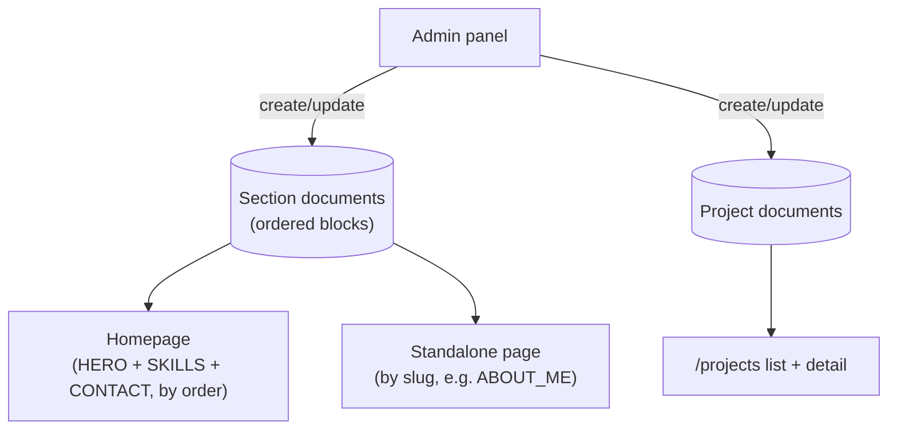

# personal-portfolio-platform

Personal portfolio with an admin panel for editing content (homepage sections, an "About Me" subpage, projects) without touching code.

## Stack

- [Nuxt 4](https://nuxt.com/) (Vue 3, TypeScript, Nitro)
- MongoDB + [Mongoose](https://mongoosejs.com/)
- [Pinia](https://pinia.vuejs.org/) for client state
- Tailwind CSS
- JWT authentication (`bcryptjs` + `jsonwebtoken`)
- File uploads: local disk (dev) or S3-compatible storage, e.g. Cloudflare R2 (prod)
- Docker / Docker Compose

## Requirements

- Node.js `>=22.0.0`
- Docker + Docker Compose (recommended for local development)

## Architecture

Request flow: the Nuxt app (SSR + client) calls the Nitro API (`server/api/v1/*`), which delegates to controllers (`server/controllers/*`), which read/write MongoDB through Mongoose models. Auth is a JWT bearer token; each route enforces the `ADMIN`/`GUEST` role it needs. File uploads go through a storage driver (local disk or S3-compatible), and the resulting path/URL is what gets stored on content documents.



Content model: the site is CMS-like. A `Section` document holds an ordered list of `blocks`; each block is discriminated by its `kind` and rendered generically, so adding or editing content is a data change, not a code change. Sections are composed differently depending on their `type`:

- `HERO`, `SKILLS`, `CONTACT` sections are collected and ordered (by `order`) onto the homepage.
- `ABOUT_ME` (and any other non-homepage `type`) is addressed individually by `slug` on a standalone page route.

`Project` documents are a separate, flat content type (no blocks) listed on `/projects` and rendered individually by id.



## Models

`Image` is an embedded object (no own collection), reused by `Section` `IMAGE` blocks and by `Project`.

| Field     | Type   | Required | Notes                                                  |
| --------- | ------ | -------- | ------------------------------------------------------ |
| `srcPath` | String | Yes      | must end in `.png`, `.jpg`, `.jpeg`, `.webp` or `.svg` |
| `altText` | String | Yes      | —                                                      |

### User

| Field                     | Type                          | Required | Notes                                                         |
| ------------------------- | ----------------------------- | -------- | ------------------------------------------------------------- |
| `email`                   | String                        | Yes      | unique, must be a valid email                                 |
| `password`                | String                        | Yes      | min 8 chars; hashed before save, never returned as plain text |
| `username`                | String                        | Yes      | 3-50 chars                                                    |
| `role`                    | String enum: `ADMIN`, `GUEST` | No       | default `GUEST`                                               |
| `avatar`                  | String                        | No       | default `null`                                                |
| `createdAt` / `updatedAt` | Date                          | auto     | timestamps                                                    |

### Section

| Field                     | Type                                                 | Required | Notes                                       |
| ------------------------- | ---------------------------------------------------- | -------- | ------------------------------------------- |
| `title`                   | String                                               | No       | 3-64 chars, default `null`                  |
| `slug`                    | String                                               | Yes      | unique, 2-50 chars, used for routing        |
| `type`                    | String enum: `HERO`, `SKILLS`, `CONTACT`, `ABOUT_ME` | No       | default `HERO`                              |
| `order`                   | Number                                               | Yes      | position among sections in the same context |
| `blocks`                  | Array of Block                                       | Yes      | at least 1 block                            |
| `createdAt` / `updatedAt` | Date                                                 | auto     | timestamps                                  |

Each entry in `blocks` is discriminated by `kind`:

| `kind`      | Field        | Type        | Required | Notes                                                                              |
| ----------- | ------------ | ----------- | -------- | ---------------------------------------------------------------------------------- |
| `PARAGRAPH` | `paragraphs` | String[]    | Yes      | at least 1 entry, each non-empty                                                   |
| `IMAGE`     | `images`     | Image[]     | Yes      | at least 1 entry                                                                   |
| `BUTTON`    | `buttons`    | String[]    | Yes      | at least 1 entry, each non-empty                                                   |
| `GROUP`     | `header`     | String      | No       | at least 1 char if present                                                         |
| `GROUP`     | `items`      | GroupItem[] | Yes      | at least 1 entry; each item: `icon` (String, required), `label` (String, required) |

### Project

| Field                     | Type                                          | Required | Notes                                         |
| ------------------------- | --------------------------------------------- | -------- | --------------------------------------------- |
| `title`                   | String                                        | Yes      | unique, 3-32 chars                            |
| `technologies`            | String[]                                      | Yes      | at least 1 entry, each >1 char                |
| `startDate`               | Date                                          | Yes      | —                                             |
| `endDate`                 | Date                                          | No       | must be after `startDate` if present          |
| `shortDescription`        | String                                        | Yes      | max 64 chars                                  |
| `longDescription`         | String                                        | Yes      | 64-1024 chars                                 |
| `githubLink`              | String                                        | No       | must match a `github.com` URL, default `null` |
| `websiteLink`             | String                                        | No       | must match a URL, default `null`              |
| `projectSource`           | String enum: `UNIVERSITY`, `COMPANY`, `HOBBY` | No       | default `HOBBY`                               |
| `mainImage`               | Image                                         | Yes      | —                                             |
| `otherImages`             | Image[]                                       | No       | —                                             |
| `status`                  | String enum: `IN PROGRESS`, `COMPLETED`       | No       | default `COMPLETED`                           |
| `gainedExperience`        | String[]                                      | Yes      | at least 1 entry, each >1 char                |
| `createdAt` / `updatedAt` | Date                                          | auto     | timestamps                                    |

## Development

Copy the environment file first (shared by both setups below):

```bash
cp .env.development.example .env.development
```

Seeding (either setup) fills minimal data — 1 admin, homepage sections, "About Me", 1 project. The script is idempotent: upserts the admin by `email` (password only changes with `SEED_RESET_ADMIN=true`), sections by `slug`, and the project by `title`.

### With Docker (recommended)

1. Start the development stack (app + MongoDB):

   ```bash
   docker compose --env-file .env.development up --build
   ```

2. Seed — once, after every Mongo volume reset, or after editing `scripts/seed/data.ts` (`--build` is required: the `seed` service is a built image, so `run` alone reuses a stale cached build and silently re-applies old seed data):

   ```bash
   docker compose --env-file .env.development --profile seed run --build --rm seed
   ```

App: http://localhost:3000 (`APP_PORT` in `.env.development`).

### Without Docker (local Node + external Mongo)

1. Point `MONGODB_URI` in `.env.development` to a reachable Mongo instance (local install or Atlas).
2. Install dependencies and start the dev server:

   ```bash
   npm install
   npm run dev
   ```

3. Seed:

   ```bash
   npm run seed
   ```

### Tests and code quality

```bash
npm run lint
npm run test:unit # unit tests in Node env
npm run test:nuxt # unit tests in Nuxt env
npm run coverage
```

## Production (overview)

- The app image is built from [Dockerfile](Dockerfile) (multi-stage, `node:22-slim`), published to GHCR (`ghcr.io/geniuszmath75/personal-portfolio-platform`), and run on the VPS via [docker-compose.prod.yml](docker-compose.prod.yml) — the VPS only pulls a tagged image (`IMAGE_TAG`, default `latest`).
- Database: MongoDB Atlas (connection string in `NUXT_MONGO_DB_URI`, see [.env.production.example](.env.production.example)) — the production Compose stack has no local Mongo.
- File uploads: S3-compatible storage (e.g. Cloudflare R2) via `UPLOAD_DRIVER=s3`.
- Healthcheck: `GET /api/v1/health` (process liveness + Mongo connection state), used by the Docker image's `HEALTHCHECK`.
- Deploy: pushing a `v*` tag runs [.github/workflows/deploy.yml](.github/workflows/deploy.yml) — builds & pushes the image to GHCR, then SSHes into the VPS to pull and restart it.

## Environment variables

See the example files:

- [.env.example](.env.example) — full reference with all variables and comments
- [.env.development.example](.env.development.example) — dev with local Mongo (Docker Compose)
- [.env.production.example](.env.production.example) — prod with Atlas + S3/R2
